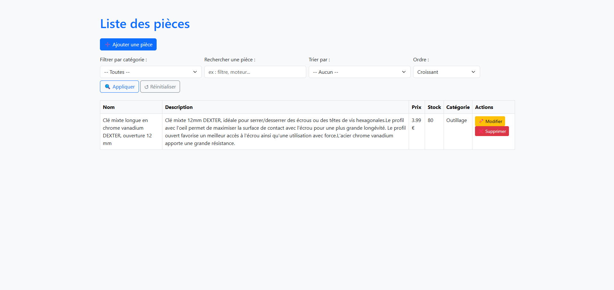

# 🚗 AutoManager

**AutoManager** est une application de gestion de pièces automobiles, conçue pour gérer l'ajout, la modification, la suppression et l'affichage de pièces via une interface web moderne.

---

## ✨ Fonctionnalités

- CRUD complet sur les pièces auto
- Système de catégories personnalisables
- Recherche par nom
- Filtre par catégorie
- Tri par prix ou stock
- Pagination
- Authentification admin sécurisée
- Interface responsive avec Bootstrap 5

---

## 🛠️ Technologies utilisées

- PHP 8+
- MySQL
- HTML/CSS/JS
- Bootstrap 5
- Architecture MVC simple
- Sessions PHP pour l'authentification

---

## ⚙️ Installation

### 1. Clone le dépôt
```bash
git clone https://github.com/AJOUIRJAayoub/AutoManager.git
```

### 2. Configure ta base de données

Crée une base nommée `automanager` et exécute cette requête :

```sql
CREATE TABLE categories (
    id INT AUTO_INCREMENT PRIMARY KEY,
    nom VARCHAR(100) NOT NULL
);

CREATE TABLE pieces (
    id INT AUTO_INCREMENT PRIMARY KEY,
    nom VARCHAR(100) NOT NULL,
    description TEXT,
    prix DECIMAL(10,2),
    stock INT,
    category_id INT,
    created_at TIMESTAMP DEFAULT CURRENT_TIMESTAMP,
    FOREIGN KEY (category_id) REFERENCES categories(id) ON DELETE SET NULL
);
```

Puis, exécute `setup_categories.php` une seule fois pour insérer les catégories de base.

### 3. Configure la connexion MySQL

Dans `app/core/Database.php`, adapte les identifiants :

```php
$host = 'localhost';
$dbname = 'automanager';
$username = 'root';
$password = '';
```

### 4. Lance le projet localement

Via XAMPP, MAMP, Laragon ou tout autre serveur local.

Accède à :  
📍 `http://localhost/AutoManager/public/login.php`

Identifiants par défaut :  
🔐 Mot de passe admin : `admin123`

---

## 📸 Aperçu



---

## 👨‍💻 Auteur

Projet réalisé par **[AJOUIRJA Ayoub]** 
